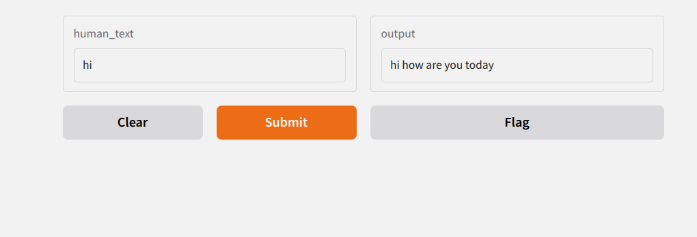

<!-- Improved compatibility of back to top link: See: https://github.com/othneildrew/Best-README-Template/pull/73 -->

<!--
*** Thanks for checking out the Best-README-Template. If you have a suggestion
*** that would make this better, please fork the repo and create a pull request
*** or simply open an issue with the tag "enhancement".
*** Don't forget to give the project a star!
*** Thanks again! Now go create something AMAZING! :D
-->

<!-- PROJECT SHIELDS -->
<!--
*** I'm using markdown "reference style" links for readability.
*** Reference links are enclosed in brackets [ ] instead of parentheses ( ).
*** See the bottom of this document for the declaration of the reference variables
*** for contributors-url, forks-url, etc. This is an optional, concise syntax you may use.
*** https://www.markdownguide.org/basic-syntax/#reference-style-links
-->
<!-- [![Contributors][contributors-shield]][contributors-url]
[![Forks][forks-shield]][forks-url]
[![Stargazers][stars-shield]][stars-url]
[![Issues][issues-shield]][issues-url]
[![Unlicense License][license-shield]][license-url]
[![LinkedIn][linkedin-shield]][linkedin-url] -->

<!-- PROJECT LOGO -->
 

    

  <h3 align="center">Desafíos 4 Chatbot con un modelo encoder - decoder</h3>

<!-- ABOUT THE PROJECT -->
## Acerca del desafío

Entrenar un modelo con el conjunto de datos obtenidos del siguiente enlace [LINK](http://convai.io/data/) de modo que responda preguntas.

(<a href="#readme-top">Regresar al inicio</a>)

<!-- GETTING STARTED -->
## Conclusiones

    

*Captura de la herramienta Gradio para mostrar una interfaz gráfica que llama al modelo entrenado en la notebook.*

- Se logró entrenar un modelo ecoder-decorder para respoder a secuencias de palabras en inglés.
- Aunque se relizó una limpieza más exhaustiva del dataset, las respuestas no siempre mantienen coherencia. Esto se prodría mejorar agregando más datos con un contexto más enriquecido
